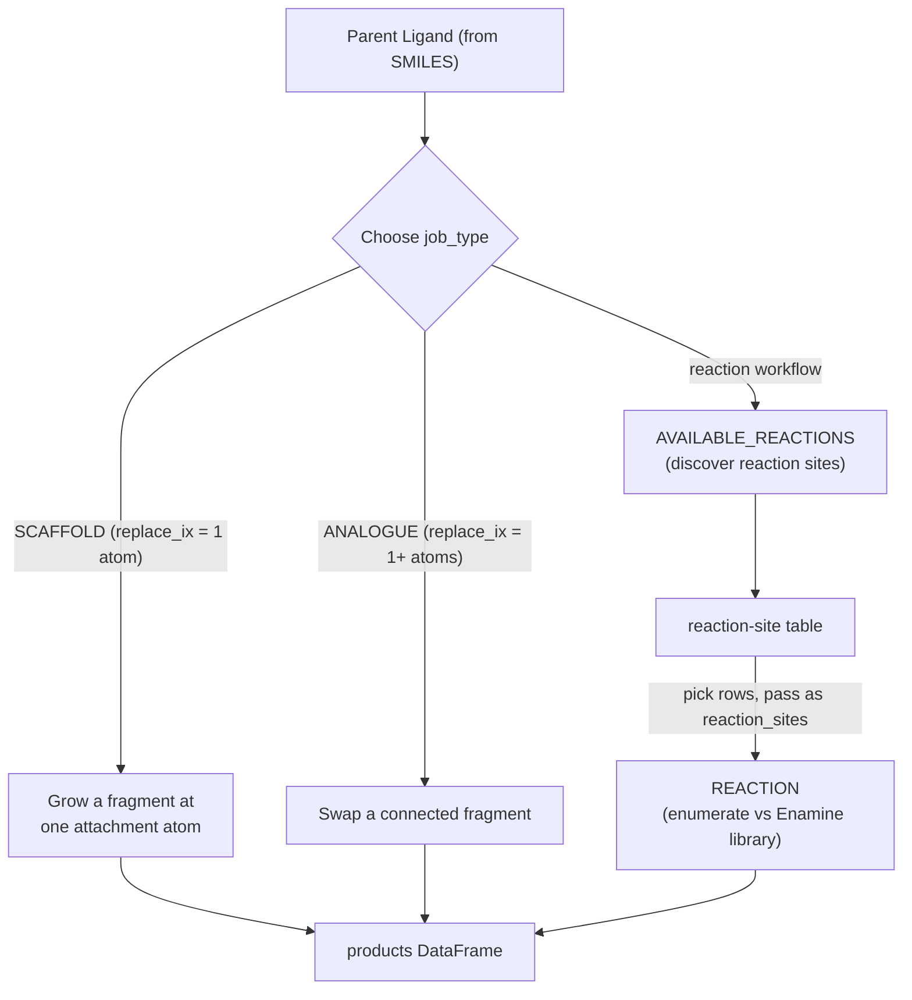

# Enumerator

Generate [analogue :octicons-link-external-16:](https://en.wikipedia.org/wiki/Structural_analog) libraries
from a parent [`Ligand`](../ref/ligand.md) on the Deep Origin platform.

To run it you need:

- a parent `Ligand` (built from a SMILES string)
- a `job_type` that picks the enumeration mode (see the table below)
- the inputs that mode requires (e.g. atom indices for matched-molecular-pair
  ([MMP :octicons-link-external-16:](https://en.wikipedia.org/wiki/Matched_molecular_pair_analysis)) modes)

Create an `Enumerator`, call `run()`, and get a `pandas.DataFrame` of results
back. `run()` blocks until the job finishes, so you must be logged in
(`deeporigin login`) before calling it.

## Modes

The tool exposes four `job_type` values:

| `job_type` | What it does | Key inputs | Output |
| --- | --- | --- | --- |
| `SCAFFOLD` | MMP: grow a fragment at one attachment atom | `replace_ix` (one atom index) | products CSV |
| `ANALOGUE` | MMP: swap a connected fragment | `replace_ix` (one or more indices) | products CSV |
| `AVAILABLE_REACTIONS` | Discover named-reaction sites on the parent | none | reaction-site table |
| `REACTION` | Enumerate products against the [Enamine :octicons-link-external-16:](https://enamine.net/) fragment library | `reaction_sites` | products CSV |

`SCAFFOLD` and `ANALOGUE` are the two MMP flavors, both
backed by [CReM :octicons-link-external-16:](https://github.com/DrrDom/crem). `AVAILABLE_REACTIONS` is a
discovery step (it writes no CSV); its
output feeds `REACTION`.

The two workflows below are independent — pick MMP *or* reaction enumeration:



## MMP enumeration (SCAFFOLD / ANALOGUE)

MMP modes take explicit RDKit atom indices (`replace_ix`) marking the enumeration
site. `SCAFFOLD` grows a new fragment at a single attachment atom; `ANALOGUE`
replaces a connected fragment defined by one or more atom indices.

```{.python notest}
from deeporigin.drug_discovery import Enumerator, Ligand

parent = Ligand.from_smiles("Brc1ccccc1")

# Grow a fragment at atom 0
scaffold = Enumerator(ligand=parent, job_type="SCAFFOLD", replace_ix=0)
df = scaffold.run()
df.head()
```

Tune the CReM search with `radius` (1-5) and `max_fragment_size` (1-15):

```{.python notest}
analogue = Enumerator(
    ligand=parent,
    job_type="ANALOGUE",
    replace_ix=[0, 1],
    radius=2,
    max_fragment_size=8,
)
df = analogue.run()
```

The returned DataFrame is the descriptor-enriched `results.csv`: enumeration
metadata columns plus RDKit descriptors (`molecular_weight`, `hbond_donor_count`,
`hbond_acceptor_count`, `logp`, `tpsa`, `rotatable_bond_count`). After a run,
`enumerator.cap_hit` indicates whether the platform enumeration cap was reached.

## Reaction enumeration (AVAILABLE_REACTIONS then REACTION)

Choosing valid reaction sites by hand is error-prone, so run `AVAILABLE_REACTIONS`
first to discover them. Each row gives a `reaction_id`, `reaction_name`,
`reactant_role`, and the `atom_indices` of the matched site.

```{.python notest}
sites = Enumerator(ligand=parent, job_type="AVAILABLE_REACTIONS").run()
sites
```

Pick the rows you want and pass them verbatim as `reaction_sites` to a `REACTION`
run:

```{.python notest}
df = Enumerator(
    ligand=parent,
    job_type="REACTION",
    reaction_sites=[
        {"reaction_id": "suzuki", "reactant_role": "core_halide", "atom_indices": [0, 1]},
    ],
).run()
df.head()
```

`REACTION` accepts up to 16 sites. Each site must match a hit returned by
`AVAILABLE_REACTIONS` on the same parent, otherwise the tool rejects the request.

## Existing executions

Reconstruct an `Enumerator` from an existing tools execution ID (for example to
re-fetch results in a later session):

```{.python notest}
enum = Enumerator.from_id("<executionId>")
df = enum.get_results()
```

To re-fetch results from the most recently created `Enumerator` run without its
ID, use `from_last_run()`:

```{.python notest}
enum = Enumerator.from_last_run()
df = enum.get_results()
```

If you already have the execution payload from `client.executions.get`, use
`Enumerator.from_dto(dto)` instead.

See the [API reference](../ref/enumerator.md) for the full signature.
