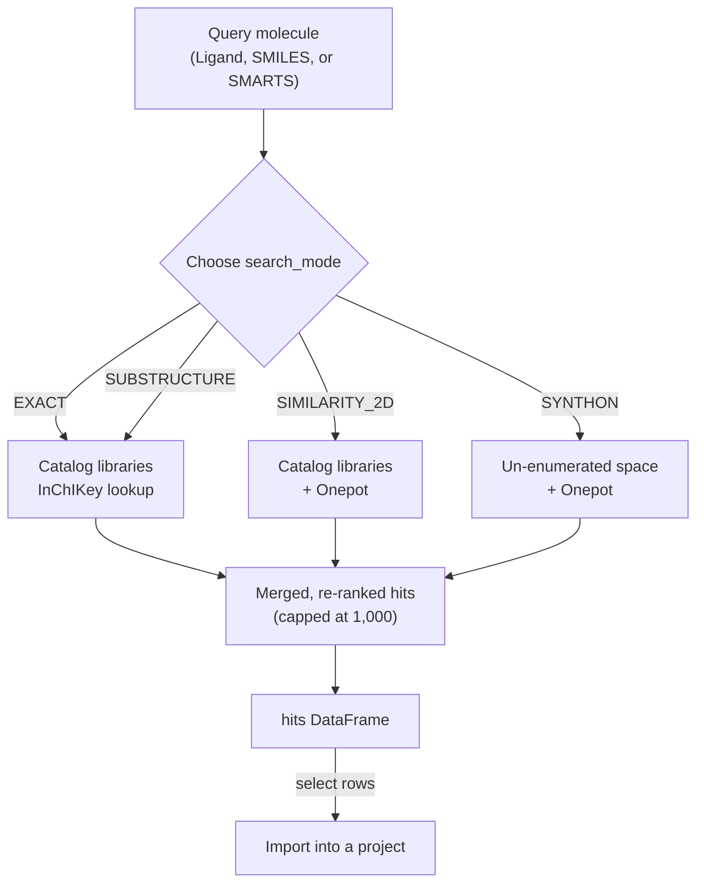

# Ligand Search

Search vendor compound libraries for molecules related to a query structure on
the Deep Origin platform.

To run it you need:

- a query molecule — a [`Ligand`](../ref/ligand.md), a SMILES string, or a
  [SMARTS :octicons-link-external-16:](https://www.daylight.com/dayhtml/doc/theory/theory.smarts.html)
  pattern for substructure search
- a `search_mode` that picks how matching works (see the table below)
- the `libraries` to search — not every library can serve every mode

Create a `LigandSearch`, call `run()`, and get a `pandas.DataFrame` of hits
back. `run()` blocks until the search finishes, so you must be logged in
(`deeporigin login`) before calling it.

## Modes and libraries

The tool exposes four `search_mode` values, and each library can serve only some
of them:

| `search_mode` | `enamine_hll`, `enamine_screening` | `onepot` | `enamine_real_synthons` |
| --- | --- | --- | --- |
| `EXACT` | ✅ [InChIKey :octicons-link-external-16:](https://www.inchi-trust.org/) lookup | ❌ | ❌ |
| `SUBSTRUCTURE` | ✅ smallest matches first | ❌ | ❌ |
| `SIMILARITY_2D` | ✅ ECFP4 or ErG fingerprints | ✅ | ❌ |
| `SYNTHON` | ❌ | ✅ as plain similarity | ✅ |

Onepot is a make-on-demand compound space reachable only through a search
interface — it has no downloadable catalog, so it cannot answer "is this exact
compound present?" or "which compounds contain this fragment?". Asking it for
`EXACT` or `SUBSTRUCTURE` is rejected rather than answered wrongly.

Selecting several libraries searches them all, merges the results into one
ranked list, and applies the result cap once across the merged list. A library
that cannot serve the mode contributes nothing and a warning rather than failing
the search; if *none* of the libraries you picked can serve the mode, that is an
error and `LigandSearch` raises before contacting the platform.



## Similarity search

`SIMILARITY_2D` is the common case: find compounds that resemble your query.

```{.python notest}
from deeporigin.drug_discovery import Ligand, LigandSearch

query = Ligand.from_smiles("CC(=O)Nc1ccc(O)cc1")

search = LigandSearch(
    query=query,
    search_mode="SIMILARITY_2D",
    libraries=["enamine_hll", "enamine_screening"],
)
hits = search.run()
hits.head()
```

Two levers shape the result set. `fingerprint` picks how molecules are compared —
`ECFP4`, an [extended-connectivity fingerprint :octicons-link-external-16:](https://doi.org/10.1021/ci100050t)
that captures circular atom environments, or `ERG`, an
[extended reduced graph :octicons-link-external-16:](https://doi.org/10.1021/ci050457y)
that abstracts a molecule to its pharmacophoric features and so matches more
loosely. `threshold` sets the minimum
[Tanimoto similarity :octicons-link-external-16:](https://en.wikipedia.org/wiki/Jaccard_index)
a hit must reach.

```{.python notest}
search = LigandSearch(
    query=query,
    search_mode="SIMILARITY_2D",
    libraries=["enamine_hll"],
    fingerprint="ERG",
    threshold=0.5,
    limit=250,
)
hits = search.run()
```

!!! note "`threshold` defaults to 0.4"
    0.4 is lower than similarity thresholds you may have seen elsewhere, and it
    is deliberate. Measured across every compound in the 460,160-molecule
    Enamine HLL library, the closest match to acetaminophen scored 0.600 and the
    closest to phenol scored 0.357 — a 0.7 threshold returns nothing at all for
    realistic queries. Result-set size is bounded by `limit` instead, which keeps
    the two independent: raise `threshold` to demand closer matches, lower
    `limit` to get a shorter list.

## Exact and substructure search

`EXACT` answers whether a specific compound is purchasable, matching on
[InChIKey :octicons-link-external-16:](https://www.inchi-trust.org/) so that
equivalent ways of writing the same structure still match.

```{.python notest}
hits = LigandSearch(
    query="CC(=O)Nc1ccc(O)cc1",
    search_mode="EXACT",
    libraries=["enamine_hll"],
).run()
```

`SUBSTRUCTURE` finds every compound containing a fragment, given as a
[SMARTS :octicons-link-external-16:](https://www.daylight.com/dayhtml/doc/theory/theory.smarts.html)
pattern:

```{.python notest}
hits = LigandSearch(
    smarts="c1ccccc1Br",
    search_mode="SUBSTRUCTURE",
    libraries=["enamine_hll", "enamine_screening"],
).run()
```

Substructure hits come back smallest first, by heavy-atom count. That ordering
is usually what you want — the smallest compounds containing your fragment are
the closest thing to the fragment itself — and it means a capped result set is
the smallest matches rather than an arbitrary slice.

## Synthon search

`SYNTHON` searches space that has not been enumerated: compounds that do not yet
exist as catalog entries, but that the supplier could make. The query is cut at
each breakable bond, each fragment is matched against compatible building blocks,
and candidates are rebuilt from the surviving pairs and scored whole.

```{.python notest}
search = LigandSearch(
    query=query,
    search_mode="SYNTHON",
    libraries=["enamine_real_synthons"],
    synthon_prefilter_size=200,
)
search.start()
search.wait()
hits = search.get_results()
```

Use `start()` and `wait()` (or `watch()` in a notebook) rather than `run()` here.
A synthon search takes minutes where the other modes take seconds, and its cost
grows roughly with the square of `synthon_prefilter_size` — that parameter is the
dominant lever on how long it runs.

Synthon hits differ from catalog hits in the results table. Their `result_type`
is `reconstructed`, they carry `synthon_ids` and `reaction_rules`, and they have
no `vendor_catalog_id` and no `vendor_url` — there is no catalog page to link to
for a compound that has not been made yet.

!!! warning "`reaction_rules` must match the library"
    `reaction_rules` defaults to `brics`, after the
    [BRICS :octicons-link-external-16:](https://doi.org/10.1002/cmdc.200800178)
    bond-breaking rules. A compound is only genuinely orderable if the supplier's
    own reactions can build it from the supplier's own building blocks, so a
    library records which rule set it was built with and refuses a search that
    disagrees. `reaction_rules="enamine"` is accepted by the SDK but currently
    refused by the platform, pending a vendor building-block feed.

Selecting `onepot` alongside `enamine_real_synthons` is a supported combination,
not a mistake: Onepot runs ordinary similarity for that query and the two result
sets merge.

## Results

Every mode returns the same table. One row per hit, with the compound
(`smiles`, `inchikey`), where it came from (`library`, `vendor_name`,
`vendor_catalog_id`, `vendor_url`), how well it matched (`score`, `match_size`),
the vendor's own properties (`vendor_molecular_weight`, `vendor_logp`,
`vendor_tpsa`) and computed descriptors (`hbd`, `hba`, `rotatable_bonds`,
`heavy_atoms`).

A search returns at most 1,000 hits. When a search reaches that cap the table is
truncated, and `search.cap_hit` tells you so:

```{.python notest}
hits = search.run()

search.cap_hit    # True if the 1,000-hit cap truncated the results
search.row_count  # number of hits returned
```

If `cap_hit` is `True`, there were more matches than you are seeing — raise
`threshold` to demand closer matches rather than raising `limit`, which is
already at its maximum.

## Importing hits into a project

Searching does not add anything to your project. To keep hits, select the rows
you want and import them, which creates the ligands and attaches their vendor
information as pinned columns:

```{.python notest}
hits = search.run()

# Keep the closest matches that are actually orderable
selection = hits[(hits["score"] > 0.55) & (hits["vendor_catalog_id"].notna())]
```

To hand the raw results file to the import step without loading it into the
session first, use `download_results()`:

```{.python notest}
search.download_results("ligand-search-hits.csv")
```

## Existing executions

Reconstruct a `LigandSearch` from an existing execution ID (for example to
re-fetch results in a later session):

```{.python notest}
search = LigandSearch.from_id("<executionId>")
hits = search.get_results()
```

To re-fetch results from the most recently created `LigandSearch` run without its
ID, use `from_last_run()`:

```{.python notest}
search = LigandSearch.from_last_run()
hits = search.get_results()
```

See the [API reference](../ref/ligand_search.md) for the full signature.
