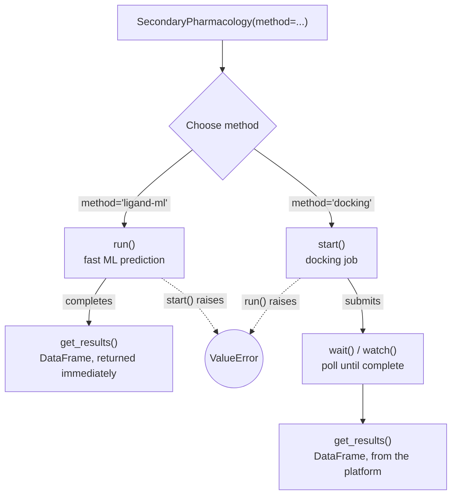

# Secondary Pharmacology

Score ligands against a secondary-pharmacology kinase panel with
[`SecondaryPharmacology`](../ref/secondary_pharma.md). See what's currently
in the panel with `SecondaryPharmacology.get_panel()`.

## Two execution modes on one class

`SecondaryPharmacology` wraps two mutually-exclusive scoring paths, selected
by `method` at construction:

`method` has no default — the two paths differ enough in cost and latency
that picking one should be deliberate.

- `method="ligand-ml"` — fast ML-based activity predictions across the panel,
  returned immediately. Use [`run()`](../ref/secondary_pharma.md).
- `method="docking"` — physically docks each ligand against the panel and
  scores the poses. Submitted as a background job — use
  [`start()`](../ref/secondary_pharma.md), then wait for it to finish.

`run()`, `start()`, and `watch()` are all available on every instance, but
only the one matching `method` works — the others raise immediately, telling
you which to call instead:



`get_results()` always returns a `pandas.DataFrame` regardless of method,
with a `method` column so a saved/exported result is still self-identifying.
On the docking path, allow a moment after `wait()`/`watch()` completes —
results land in the platform's data index rather than the immediate
response, the same as [`Docking.get_results()`](../ref/docking.md).

## Ligand-ML scoring

```{.python notest}
from deeporigin.drug_discovery import SecondaryPharmacology, Ligand

ligand = Ligand.from_smiles("CCO")
job = SecondaryPharmacology(ligands=[ligand], method="ligand-ml")
df = job.run()
```

`df` has one row per ligand × panel member: `uniprot_id`, `gene_name`, and
either `p_active` (classification) or `p_affinity` (regression, -log10 M).
`ligand_id` should always be populated, even if `ligand` wasn't registered with the
platform beforehand.

See what's currently in the panel with `SecondaryPharmacology.get_panel()`:

```{.python notest}
SecondaryPharmacology.get_panel()          # first 10 members, with a count hint
SecondaryPharmacology.get_panel(full=True) # every member
```

Restrict to a subset of the panel with `uniprots`:

```{.python notest}
job = SecondaryPharmacology(
    ligands=[ligand],
    method="ligand-ml",
    uniprots=["P00533"],  # EGFR only
)
```

Passing `self_test=True` instead of `ligands` scores a test ligand
against the full panel using ML method, for checking scoring end to end.

`job.plot()` renders a heatmap of ligand × target, colored by score.

## Docking

```{.python notest}
job = SecondaryPharmacology(
    ligands=[ligand],
    method="docking",
    effort=2,
    batch_size=30,
)
job.start()
job.wait()               # or `await job.watch()` in a notebook
df = job.get_results()
```

`df` has one row per docked pose: `pose_score`, `binding_energy`, and
`file_path`. Use `pose_score`/`binding_energy` to read results -- viewing
the docked structure itself isn't supported yet.

`job.plot()` renders a heatmap colored by `binding_energy` (default) or
`metric="pose_score"`, auto-scaled to the run's own values unless you pass
`clim=(low, high)` -- a value outside it still renders, clipped to the
nearest edge color.

Check for gaps with `job.get_undocked_ligands()` (ligands with zero docked
poses) or `job.get_missing_pairs()` (specific ligand × target cells missing).

Docking work is split into parallel batches automatically. `batch_size`
(default 30) caps how many ligand × target pairs go into each batch --
lower it for more parallelism, raise it to reduce per-batch overhead. A
single target's pairs always stay in one batch, even if that pushes it
over `batch_size`. Ignored on the ligand-ml path.

## Working with existing runs

```{.python notest}
from deeporigin.drug_discovery import SecondaryPharmacology

# By execution id:
job = SecondaryPharmacology.from_id("<executionId>")

# Or the most recently created SecondaryPharmacology run:
job = SecondaryPharmacology.from_last_run()

job.sync()
df = job.get_results()
```

`from_dto`/`from_id`/`from_last_run` restore `method`, `ligands`, `uniprots`,
`effort`, and `self_test` from the stored execution inputs. `uniprots` of a
loaded run cannot be changed — call `duplicate()` first to get an editable
copy, validated against the current panel.

Don't know the execution id? List every past run, newest first:

```{.python notest}
runs = SecondaryPharmacology.list(status=["Completed"], project_id=client.project_id)
ml_runs = [r for r in runs if r.method == "ligand-ml"]
dock_runs = [r for r in runs if r.method == "docking"]
```

`project_id` restricts the list to your own project.
