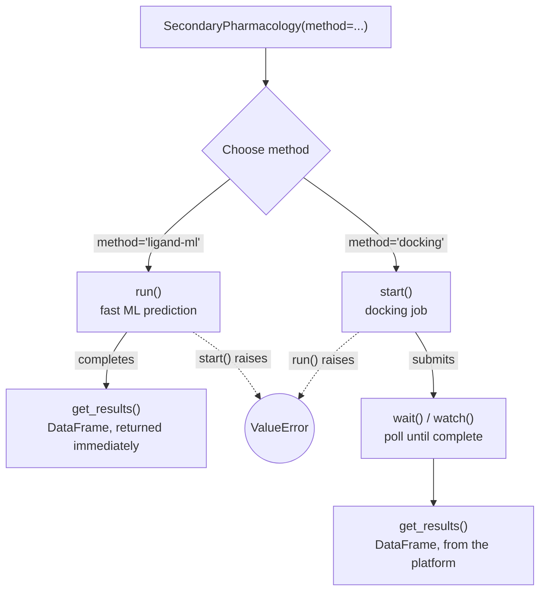

# Secondary Pharmacology

Score ligands against a secondary-pharmacology kinase panel (currently
EGFR, BRAF, and SRC — the panel is expected to grow) with
[`SecondaryPharmacology`](../ref/secondary_pharma.md).

## Two execution modes on one class

`SecondaryPharmacology` wraps two mutually-exclusive scoring paths, selected
by `method` at construction:

`method` has no default — the two paths differ enough in cost and latency
that picking one should be deliberate.

- `method="ligand-ml"` — fast ML-based activity predictions across the panel,
  returned immediately. Use [`run()`](../ref/secondary_pharma.md).
- `method="docking"` — physically docks each ligand against the panel and
  scores the poses. Submitted as a background job — use
  [`start()`](../ref/secondary_pharma.md), then wait for it to finish.

`run()`, `start()`, and `watch()` are all available on every instance, but
only the one matching `method` works — the others raise immediately, telling
you which to call instead:



`get_results()` always returns a `pandas.DataFrame` regardless of method,
with a `method` column so a saved/exported result is still self-identifying.
On the docking path, allow a moment after `wait()`/`watch()` completes —
results land in the platform's data index rather than the immediate
response, the same as [`Docking.get_results()`](../ref/docking.md).

## Ligand-ML scoring

```{.python notest}
from deeporigin.drug_discovery import SecondaryPharmacology, Ligand

ligand = Ligand.from_smiles("CCO")
job = SecondaryPharmacology(ligands=[ligand], method="ligand-ml")
df = job.run()
```

`df` has one row per ligand × panel member, with `uniprot_id`, `gene_name`,
and exactly one of `p_active` (classification) or `p_affinity` (regression,
-log10 M) set per row. `ligand_id` is always a real platform id -- `run()`
registers each ligand after scoring (a no-op if already registered), so
results are referable even when `ligand` itself was never explicitly synced.

See what's currently in the panel with `SecondaryPharmacology.panel()`:

```{.python notest}
SecondaryPharmacology.panel()          # first 10 members, with a count hint
SecondaryPharmacology.panel(full=True) # every member
```

Restrict to a subset of the panel with `uniprots`:

```{.python notest}
job = SecondaryPharmacology(
    ligands=[ligand],
    method="ligand-ml",
    uniprots=["P00533"],  # EGFR only
)
```

Passing `self_test=True` instead of `ligands` scores a test ligand
against the full panel using the real model, for checking scoring end to end.

`job.plot()` renders a heatmap of ligand × target, colored by score.

## Docking

```{.python notest}
job = SecondaryPharmacology(ligands=[ligand], method="docking", effort=2)
job.start()
job.wait()               # or `await job.watch()` in a notebook
df = job.get_results()
```

`df` has one row per docked pose, including `pose_score`, `binding_energy`,
and `file_path` -- `pose_score`/`binding_energy` are the way to consume
docking results today. Pose *visualization* isn't available yet: `pdb_id` is
a provenance label, not a fetchable, coordinate-matching key -- the panel's
actual receptor structure is pocket-aligned and doesn't match what
`Protein.from_pdb_id(pdb_id)` downloads from RCSB. Blocked on DDOS-7481.

`job.plot()` renders a heatmap colored by `binding_energy` (default) or
`metric="pose_score"`.

Check for gaps with `job.get_undocked_ligands()` (ligands with zero docked
poses) or `job.get_missing_pairs()` (specific ligand × target cells missing).

Compare a ligand-ml run against a docking run on one heatmap with
`SecondaryPharmacology.plot_ml_vs_docking(ml_job, dock_job)` -- a
`staticmethod` since it needs both.

Currently no batching is supported for the docking path (unlike `deeporigin.docking`'s `batchSize`)
and it runs as a single job with a fixed resource/time budget for the entire ligand set.

## Working with existing runs

```{.python notest}
from deeporigin.drug_discovery import SecondaryPharmacology

# By execution id:
job = SecondaryPharmacology.from_id("<executionId>")

# Or the most recently created SecondaryPharmacology run:
job = SecondaryPharmacology.from_last_run()

job.sync()
df = job.get_results()
```

`from_dto`/`from_id`/`from_last_run` restore `method`, `ligands`, `uniprots`,
`effort`, and `self_test` from the stored execution inputs. `uniprots` of a
loaded run cannot be changed — call `duplicate()` first to get an editable
copy, validated against the current panel.

Don't know the execution id? `SecondaryPharmacology.list(status=["Completed"],
project_id=client.project_id)` lists every past run, newest first.
