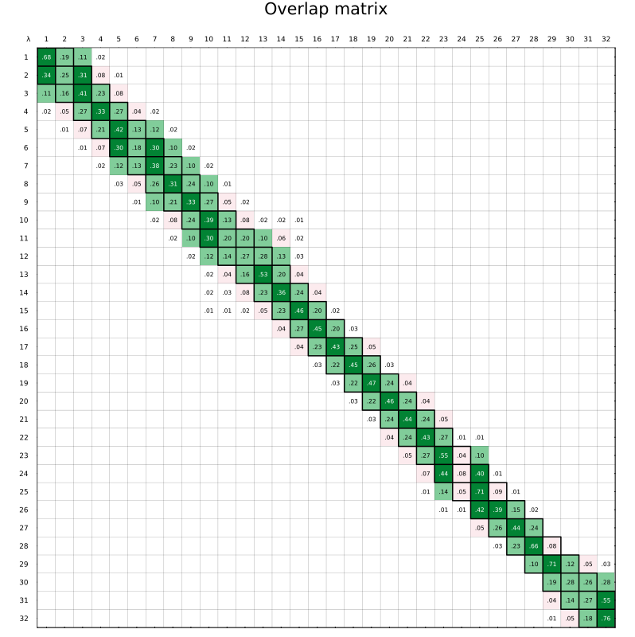
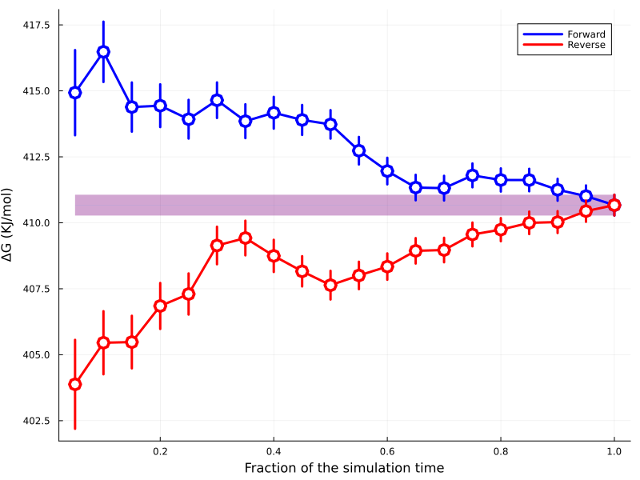

# ABFE

This document describes how to run a [ABFE :octicons-link-external-16:](https://en.wikipedia.org/wiki/Free-energy_perturbation) simulation using Deep Origin tools.

## Prerequisites

We assume that you have prepared a protein, docked a ligand to it, and obtained a pose that you want to proceed with. 

In this tutorial we will use a protein and ligand from the example dataset. 

```{.python notest}
from deeporigin.drug_discovery import (
    ABFE,
    SystemPrep,
    PreparedSystem,
    ABFEParams,
    BRD_DATA_DIR,
    Protein,
    Ligand,
)

protein = Protein.from_file(BRD_DATA_DIR / "brd.pdb")
protein.sync()

ligand = Ligand.from_sdf(BRD_DATA_DIR / "brd-2.sdf")
ligand.sync()
```

For more details on how to get started, see [:material-page-previous: Getting Started ](./getting-started.md).


## System Preparation

Before ABFE, you must turn your protein and docked ligand into a simulation-ready
systems. This step is called *system preparation*. 

For a single ligand (i.e., ABFE), system prep builds two solvated models:

1. **Binding system** — protein and ligand assembled in an explicit water box with
   ions. This is the complex used for the binding leg of ABFE.
2. **Ligand solvation system** — the same ligand alone in solvent, used for the
   solvation leg.

Along the way, Deep Origin System Prep typically:

- Cleans and standardizes the protein structure, optionally protonates it at
  physiological pH, and assigns a protein force field (default Amber ff14SB).
- Parameterizes the ligand (hydrogens, charges, GAFF2 or OpenFF), then merges it
  with the protein into a complex.
- Solvates each system (water box padding, salt, optional retention of crystal
  waters).


```{.python notest}
sysprep = SystemPrep(
    protein=protein,
    ligand=ligand,
)

system = sysprep.run()
system.show()
```


You will see something like:

<iframe 
    src="../../images/prepared-system.html" 
    width="100%" 
    height="660" 
    style="border:none;"
    title="Visualization of prepared system"
></iframe>

## Estimating costs

Before starting a ABFE run, you can estimate costs using:

```{.python notest}
abfe = ABFE(prepared_system=system)
abfe.start(quote=True)
abfe.estimate
```

You will get back a widget representing this job such as this:

<iframe 
    src="../../images/abfe-quote.html" 
    width="100%" 
    height="340" 
    style="border:none;"
    title="Quoted ABFE Job"
></iframe>

!!! warning "Example widget"
    Prices shown here are for demonstrative purposes only. Actual prices can vary. 


Note that this Job is ready to run, but will not actually run unless you approve the amount and confirm. 

## Starting an ABFE run

### Confirming a quoted Job

If you have already generated a quoted Job (using `quote` as shown above), you can start the ABFE run using:

```{.python notest}
job.confirm()
```

This will start the ABFE run and the job widget will now display:


<iframe 
    src="../../images/abfe-running.html" 
    width="100%" 
    height="340" 
    style="border:none;"
    title="Quoted ABFE Job"
></iframe>


### Multiple ligands

To run an end-to-end ABFE workflow on multiple ligands, we use:

```{.python notest}
jobs = sim.abfe.run(ligands=[sim.ligands[0],sim.ligands[1]]) 
```

Omitting the ligand will run ABFE on all ligands in the `Complex` object.


```{.python notest}
jobs = sim.abfe.run() 
```

Each ligand will be run in parallel on a separate instance, and each `Job` can be monitored and controlled independently. 


### Watch Jobs

To monitor the status of this job, use:

```{.python notest} 
job.watch() 
```

This makes the widget auto-update, and monitor the status of the job till it reaches a terminal state (`Cancelled`, `Succeeded`, or `Failed`). 

If you are using the jobs-centric [`ABFE`](../../ref/abfe.md) class with a prepared system, after `abfe.start()` you can monitor in Jupyter in two ways:

- **Non-blocking cell** (same idea as `job.watch()`): the cell returns immediately while the widget keeps updating; you can run other cells in the meantime.

```{.python notest}
task = await abfe.watch()
```

- **Blocking cell**: the cell does not finish until the execution reaches a terminal state.

```{.python notest}
await abfe.watch_async()
```

In a plain Python script (no running event loop), use:

```{.python notest}
import asyncio

asyncio.run(abfe.watch_async())
```


!!! tip "Monitoring Jobs"
    For more details about how to monitor jobs, look at this [How To section](../how-to/job.md).


## Parameters

ABFE simulation parameters are controlled via the `ABFEParams` dataclass. Default values are tuned for production runs; most users will only need to adjust a small number of fields.

### Viewing parameters

To inspect the current parameters on an `ABFE` object, access the `params` property:

```{.python notest}
from deeporigin.drug_discovery import Complex, BRD_DATA_DIR

sim = Complex.from_dir(BRD_DATA_DIR)
sim.abfe.params
```

??? success "Expected output"
    Parameters are printed one per line. Fields that have been changed from their defaults are marked with an asterisk (`*`):

    ```
    ABFEParams(
      annihilate: True
      dt: 0.004
      temperature: 298.15
      cutoff: 0.9
      repeats: 3 *
      replex_period_ps: 2.5
      test_run: 0
      binding_n_windows: 48
      binding_npt_reduce_restraints_ns: 2.0
      binding_nvt_heating_ns: 1.0
      binding_steps: 1250000
      solvation_n_windows: 32
      solvation_npt_reduce_restraints_ns: 0.2
      solvation_nvt_heating_ns: 0.1
      solvation_steps: 500000
    )
    ```

### Modifying parameters

`ABFEParams` is an immutable (frozen) dataclass. To change parameters, use `dataclasses.replace()` to create a modified copy and assign it back to the `ABFE` object:

```{.python notest}
from dataclasses import replace
from deeporigin.drug_discovery import Complex, BRD_DATA_DIR

sim = Complex.from_dir(BRD_DATA_DIR)

params = sim.abfe.params
params = replace(params, repeats=3, test_run=1)
sim.abfe.params = params
```

Multiple fields can be changed in a single `replace()` call. The original `params` object is never modified — `replace()` always returns a new instance.

!!! danger "Changing parameters may lead to simulation failures"
    Some parameters, such as `dt`, are constrained to specific ranges. You will not be allowed to start a simulation run if these parameters fall outside valid ranges.

    Changing parameters away from their defaults may lead to simulation failures.


## Results

### Viewing results

After initiating a run, we can view results using:

```{.python notest}
df = sim.abfe.show_results()
df
```  

This shows a table similar to:


| dG       | Std | AnalyticalCorr   | Repeats | SMILES                                           | r_exp_dg |
| -------- | --- | --------------   | ------- | ----------------------------------------         | -------- |
| -9.98    | 0.0 | -11.46           | 1       | COCCn1cc(-c2cccc(C(=O)N(C)C)c2)c2cc[nH]c2c1=O    | -7.22    |


### Viewing trajectories

To view MD trajectories from this run, refer to this [How-to section](../how-to/visualize-abfe-trajectories.md)


### Viewing overlap matrix

An [FEP overlap matrix](https://pmc.ncbi.nlm.nih.gov/articles/PMC8388617/) is a diagnostic used in free energy perturbation calculations to evaluate how well neighboring λ states sample overlapping regions of configuration space. Each matrix element measures the statistical overlap between configurations from different states based on their energy distributions. The goal is to ensure every state has overlap with its neighbors in both directions – so that  off-diagonal elements are sufficiently larger than zero.

If you are using the jobs-centric [`ABFE`](../ref/abfe.md) class, the plot path
is read from the data-platform result for this execution (default `repeat=1`,
same indexing as `abfe.show_trajectory`).
In Jupyter:

```{.python notest}
abfe.show_overlap_matrix(run="binding")
```

An image such as the following will be shown:



To view the overlap matrix for the solvation leg:

```{.python notest}
abfe.show_overlap_matrix(run="solvation")
```

On the deprecated [`Complex`](../ref/complex.md) path, the same plot was selected
per ligand:

```{.python notest}
sim.abfe.show_overlap_matrix(ligand=ligand, run="binding")
sim.abfe.show_overlap_matrix(ligand=ligand, run="solvation")
```

### Viewing convergence time plots

The time-convergence diagnostic (``convergence_plot`` in the result payload) can
be shown the same way as the overlap matrix.

With the jobs-centric [`ABFE`](../ref/abfe.md) class (default `repeat=1`, same
as `abfe.show_overlap_matrix` and `abfe.show_trajectory`):

```{.python notest}
abfe.show_convergence_time(run="binding")
```

An image such as the following will be shown:



For the solvation leg:

```{.python notest}
abfe.show_convergence_time(run="solvation")
```

On the deprecated [`Complex`](../ref/complex.md) path:

```{.python notest}
sim.abfe.show_convergence_time(ligand=ligand, run="binding")
```