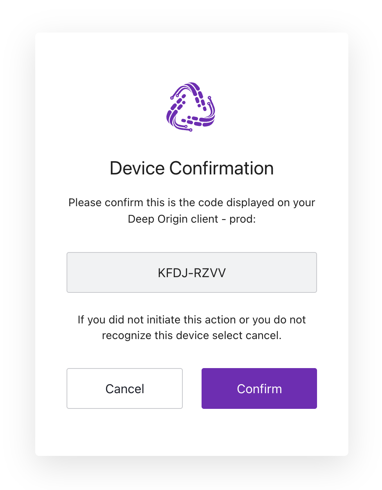
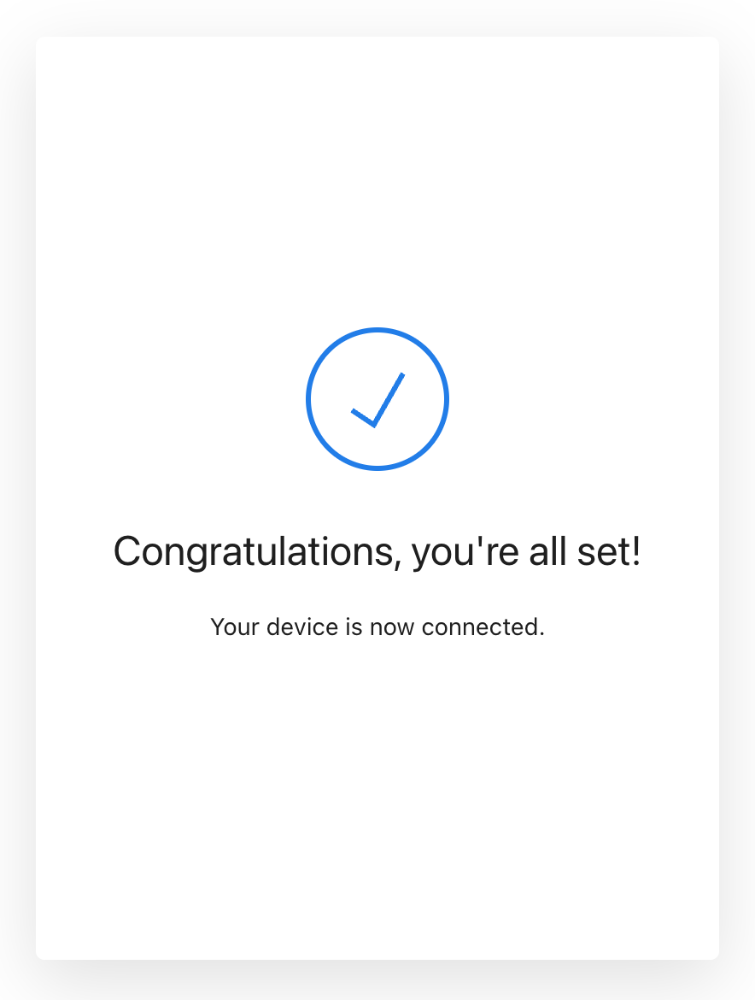

# Sign into Deep Origin

!!! tip "Configure first"
    Make sure to [configure](../configure.md) it first.

To use most of the functionality of the Python client, you must first run the following commands to sign into Deep Origin.


```{.python notest}
from deeporigin import auth
_ = auth.get_tokens()
```

When you first do this, you will be presented with a prompt similar to below:

```shell
To connect to the Deep Origin OS, navigate your browser to 

https://<env>auth0.com/activate?user_code=<code>

and verify the confirmation code is the one shown, and click the "Confirm" button.
```

When you visit that URL, you will see a prompt that looks like:



After clicking the `Confirm` button, you will see a confirmation similar to below:



After signing in, your access tokens will be cached to disk and then automatically
be used in subsequent interactions with Deep Origin.

!!! info "Authenticating"
    You only need to authenticate to the Deep Origin OS once.
    You do not need to authenticate every time you use the client.

