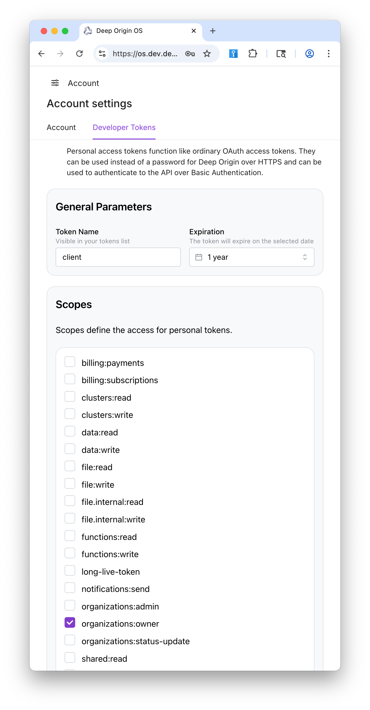
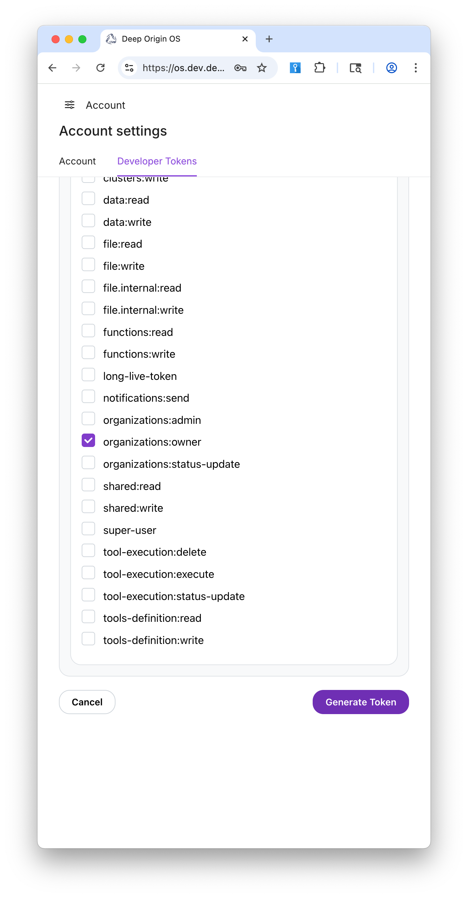

# API Tokens

## Get a platform API token

To use the Deep Origin client, you must first obtain an API token. 

Navigate to [https://os.deeporigin.io/account?tab=tokens](https://os.deeporigin.io/account?tab=tokens). You will see a screen similar to:


Press the `Generate Token` button and choose a name and expiration for your token. The longest expiration allowed is 1 year. Longer-lived tokens allow you to use that token before having to generate a new one. Choose the `organizations:owner` scope.



Scroll down and press the `Generate Token` button:



Then, copy the token using the button:


## Set the API token in the client

Now, in the client, use the following function to set the token:


```{.python notest}
from deeporigin import auth

auth.set_token("your-token-here")
```

You are now ready to use the client! 