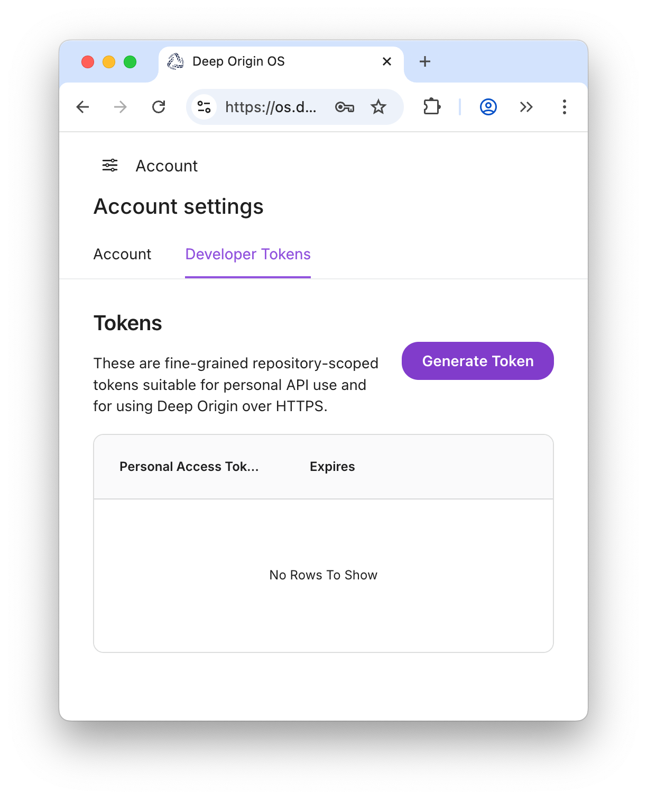
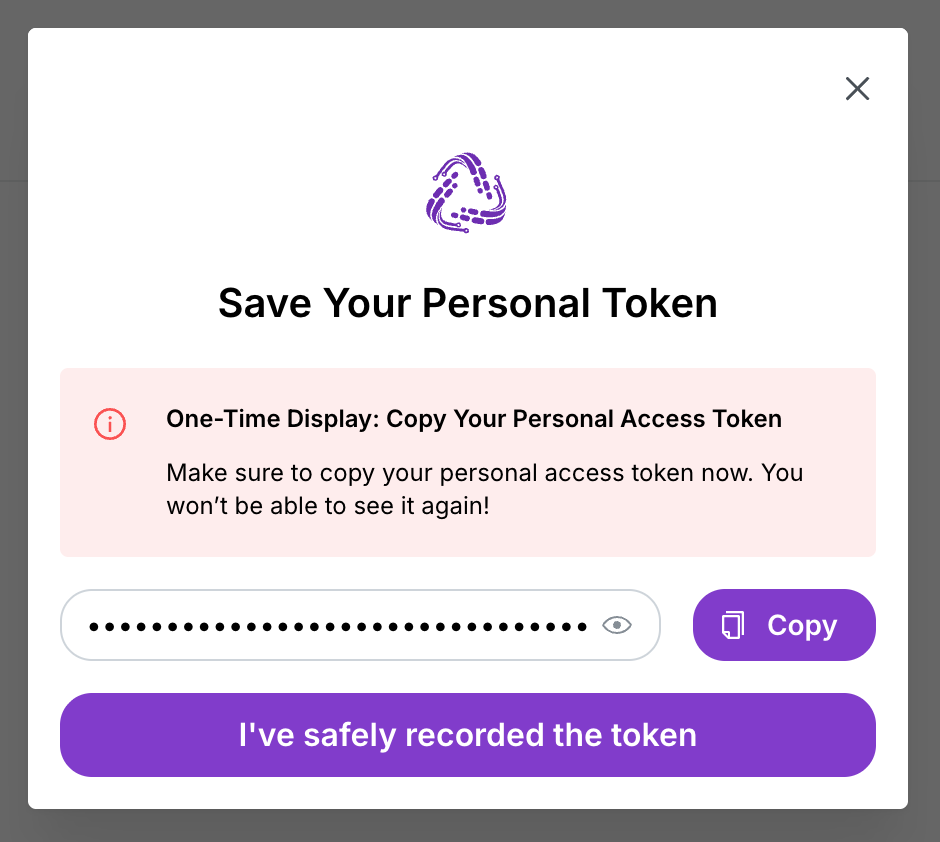

# API Tokens

## Get a platform API token

To use the Deep Origin client, you must first obtain an API token. 

Navigate to the [developer tokens tab :octicons-link-external-16:](https://os.deeporigin.io/settings?tab=tokens) in your Deep Origin account. You will see a screen similar to:



Choose a name and expiration for your token and press the `Generate Token` button. The longest expiration allowed is 1 year. Longer-lived tokens allow you to use that token before having to generate a new one. 


Then, copy the token using the button:



## Set the API token in the client

Now, in the client, use the following function to set the token:


```{.python notest}
from deeporigin import auth

auth.save_token("your-token-here")
```

You are now ready to use the client! 